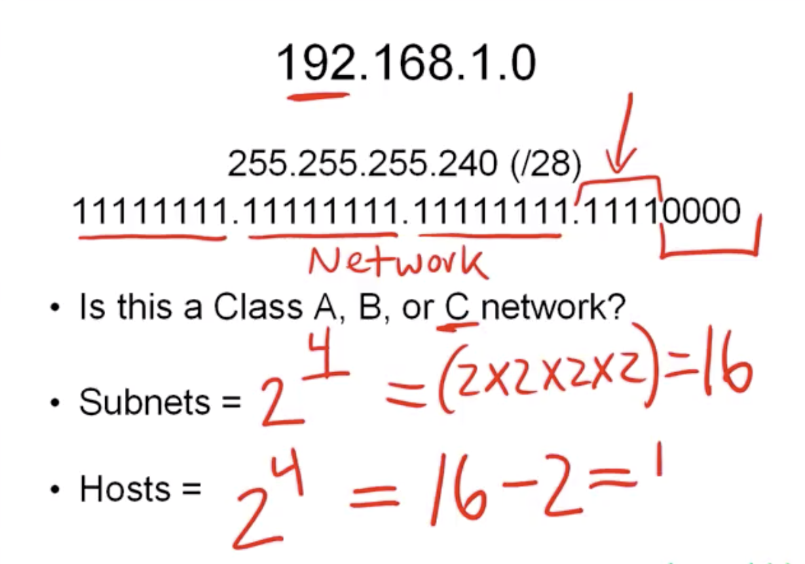
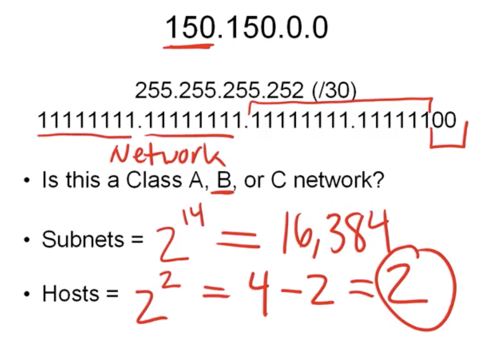

# ***IPv4 Notes lol***   


best chart for ip_adressing and subnetting
"Binary doubling reference chart"

128_ 64_ 32_ 16_ 8_ 4_ 2_ 1_    
0___ 0__ 0__ 0__ 0_ 0_ 0_ 0_ <- dit is een octet

een octet is een acht-tal binaire eentjes of nullen;

|128|64|32|16|8|4|2|1|| 
|:---|:---|:---|:---|:---|:---|:---|:--|:-
0|0|0|0|0|0|0|1| <- nu is deze octet een decimaal van 1

|128|64|32|16|8|4|2|1|| 
|:---|:---|:---|:---|:---|:---|:---|:--|:-
0|0|0|1|1|1|1|1| <- nu is deze octet een decimaal van 31

|128|64|32|16|8|4|2|1|| 
|:---|:---|:---|:---|:---|:---|:---|:--|:-
0|1|1|1|1|1|1|1| <- nu issie 127 weetjewel

IP adres is 4 x een octet**
dus 32 bits opgebroken in 4 stukjes
192.168.1.5

192 = 11000000

168 = 10101000

1	= 00000001

5	= 00000101

is dus makkelijk uit te rekenen met de chart:    
128_ 64_ 32_ 16_ 8_ 4_ 2_ 1_    
0	 0   0	 0 	 0    
192.168.1.0/24 <- achter de slash is **CIDR notation (Classless Inter Domain Routing)**     
het CIDR getal betekent hoeveel binary digits aan staan in de subnet mask,    
dus hoeveel ééntjes er zijn in de octets   
dus als de subnet mask 255.255.255.0 is is de CIDR notation /24   
want : 11111111.11111111.11111111.00000000 = 24 eentjes.   

je subnet mask laat zien welk gedeelte van de IP deel is van de network ID

wanneer je 255.255.248.0 (CIDR notation 21) over 192.168.40.55 legt krijg je het volgende:

1.|255.|248.|0
-|:-|:-|:-|   
11111111|11111111|11111000|00000000   
192.|168.|40.|55   
11000000|10101000|00101000|00110111   

Network ID

>192.168.40.0/21 <- CIDR notation

>255.255 .248.0	 <- subnet mask   

de subnet mask loopt tot waneer 40 wordt gedefinieerd in het derde octet
dus het Network ID is 192.168.40.0

de rest, de bits die buiten de subnet mask vallen zijn 'host bits'
bijvoorbeeld, wanneer je het IP 192.168.45.55 hebt en de subnet mask is nog steeds 255.255.248.0 
dan heb je:
```
1.       255.     248.     0    
11111111 11111111 11111000 00000000
192.	 168. 	  45.      55
11000000 10101000 00101101 00110111
```
en is je Network ID nog steeds 192.168.40.0 
```
1.       255.     255.     192 
 11111111 11111111 1111111  11 |000000
192.	 168. 	  45.      55  |v|dingen aan deze kant zijn host bits.
 11000000 10101000 00101101 00 |110111
 ```
je 'broadcast' adres is je Network ID + de decimal van wanneer alle binaries aan staan in je host bits    
bijvoorbeeld, in dit geval is het 192.168.45.63     
want van de laatste octet zijn de eerste twee bits deel van de subnetmask, daarna heb je nog     
192.|168.|45.|55||||||||| 
:-|:-|:-|:-|:-|:-|:-|:-|:-|:-|:-|:-|
||||128| 64| 32 |16 |8 |4 |2 |1|||
||||0|0|1|1|1 |1 |1 |1| | |
|	|		|| ||32| + 16|+ 8| + 4|+ 2| + 1 | = 63|

als je iets verstuurt naar de 'broadcast' adres wordt het naar alle adressen in het netwerk gestuurd
er zijn 62 adressen bruikbaar, eentje voor je broadcast. en meestal een voor je router, 
en de rest is vrij om dan anderen aan te verbinden.

255.255.255.0 
/24
is de meest gebruikte subnetmask.
je hebt dan 254 bruikbare adressen.

# Class System

IPv4 heeft verschillende classes

IP classes zijn default classes gebaseerd op het nummer van het eerste octet

class|1st octet range| default mask
--|:-|:-
class A|1 - 126|255.0.0.0
class B|128 - 191|255.255.0.0
class C|192 - 223|255.255.255.0
Loopback|127|  
class D| 224 - 239| Multicasting
Class E| 240 - 255.255.255.254|Experimental

# hoe doe je euh nummer hoeveelheid subnets vinden lol en valid hosts weetje

>Hoeveel subnets?, gewoon '2 tot de macht hoeveelheid subnetbits '   
$hoeveelheid$ $subnets =$ $2 ^ {subnetbits}$   

subnetbits zijn de bits die, naast de mask die gedefinieerd is door de class, zijn opzij gezet voor subnets.

ip:|192.|168.|1.|0.
:-|:-|:-|:-|:-|
mask:|255.|255.|255.|240 (/28)
||`11111111`|`11111111`|`11111111`|`11110000`|
subnetbits:||||`↑↑↑↑`
hostbits:||||`____↑↑↑↑`    




>Hoeveel valid hosts? '2 tot de macht (hoeveelheid host bits) - 2, oftewel:   
$valid$ $hosts =$ $2^{(32 - CIDR)} - 2$  

# private IP's:

Private IP's zijn als volgt: | | | | |
-:|:-|:-|:-|:-|     
192.168.0.0 |-| 192.168.255.255|     |(65,536 IP addressen)    
172.16.0.0| - |172.31.255.255| |(1,048,576 IP addressen)    
10.0.0.0| - |10.255.255.255| |(16,777,216 IP addressen)    

## __*nog wat internet protocol suite dingetjes*__

TCP = Transmission control protocol
zorgt voor betrouwbare en ge-error checkde aflevering van een stream van octets
Is geen datagram oriented protocol

PING gebruikt ICMP

UDP = User Datagram Protocol
wordt gebruikt om berichten, (Datagrams) door te sturen tussen netwerken.
Het ondersteunt broadcasting (iets naar de broadcast sturen, dus naar alle hosts
op het netwerk).

*Network layers?*

network layers is een framework die complexe netwerk interacties begrijpbaarder maakt

je hebt 't OSI model, "OPEN SYSTEM INTERCONNECTION" ontwikkeld door de ISO dingetje, die heeft 7 layers:

 *#* |type layer | voorbeeld |
 :-|:-|:-
1: |Fysiek |(kabel weetjewel RJ45)
2: |Data link |(MAC)
3: |Netwerk|(IP, Routers)
4: |Transport|(TCP, UDP, port numbers)
5: |Session|(Syn/Ack)
6: |Encryptie|(ASCII, PNG, MIDI)
7: |Applicatie|(SNMP,HTTP,FTP)

*/// PLEASE DO NOT THROW SAUSAGE PIZZA AWAY ///*

Het OSI-model van hoogste layer (7) naar laagste layer (1) uitgelegd:
 *#* |type layer | uitleg
 :-|:-|:-|
|7. |Application | Waarmee de gebruiker interact. Browsers en andere internet-verbonden apps gebruiken Layer 7 Application protocols. 
|6. |Presentation | Converteert data naar en van de Applicatie layer, vertaald applicatie formatting naar netwerk formatting enzo.
|5. |Session| Established en Terminate verbindingen met apparaten. Ook zegt het welke packets bij welke text / image files horen.
|4. |Transport | Coördineert data tranfers tussen systems en hosts, met error-checking en data recovery
|3. |Network | Beslist hoe data is verstuurd naar het apparaat, verantwoordelijk voor packet forwarding, routing en adressing.
|2. |Data link| Vertaald binary naar signalen waar de hogere layers mee kunnen werken.
|1. |Physical| De daadwerkelijke hardware bevindt zich op deze layer, verzend signalen over media (kabels)

TCP / IP is een nieuwer framework, met 4 layers:
 *#* |type layer |
 :-|:-|:-
1: |Network Access (or link)
2: |Internet
3: |Transport (or host to host)
4: |Application (or process)

*/// NUDE ANAKIN IMPALES TEARFUL ABSENTEES ///*    

Het TCP / IP model (soms *protocol stack* genoemd), kan gezien worden als een compacte versie van het OSI-model\

TCP / IP is een nieuwer framework, met 4 layers:
 *#* |type layer | uitleg
 :-|:-|:-
1: |Network Access| Ook wel *Network Interface layer* genoemd, combineert OSI's L1 en L2.
2: |Internet| Lijkt op OSI's L3.
3: |Transport| Ook wel *Host-to-Host layer* genoemd, lijkt op OSI's L4.
4: |Application| Ook wel *Process layer* genoemd, combineert OSI's L5, L6 & L7.

# wat is DHCP?

DHCP staat voor Dynamic Host Configuration Protocol, het is een netwerk protocol gebruikt in UDP/TP netwerken    
Het assigned dynamisch een IP adres en andere configuratie parameters voor elk apparaat, zodat ze kunnen communiceren.    
Als er geen DHCP server is, moet een apparaat handmatig ge-assigned worden. een router heeft een DHCP server die 
automatisch een IP adres assigned aan elk apparaat dat er aan verbind, deze adressen zijn verbonden.
--ondersteund door IPv4 en IPv6

# wat is DNS server en DNS protocol?
DNS  is een hierarchisch systeem dat aan het internet verbonden systemen een naam geeft. Het verbindt verscheidene informatie
met domein namen, zoals IP adressen aan domeinnamen,het specificeert ook technische functies van de database.

# to do:
- [ ] Beter inzicht krijgen in de details van UDP & TCP & DHCP
- [ ] het DING
- [ ] Dingetje aflezen en misschien nog wat youtube filmpjes kijken hahahahahhahahahaha 


dingetje:
https://docs.google.com/document/d/1yKjb-4og1OYJi9eASbxUnoo3b4vJ4tG68oRhQd5vfMw/edit

